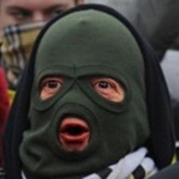
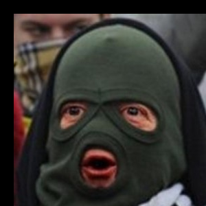
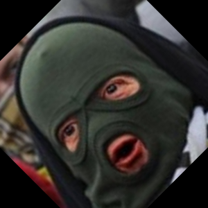
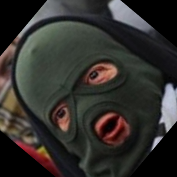
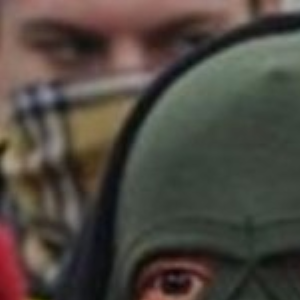
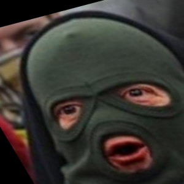
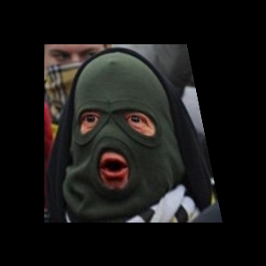
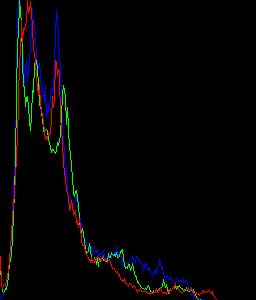
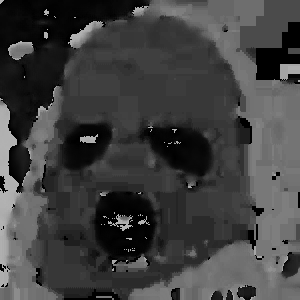
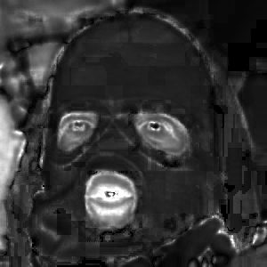

## Week 3

- Projection (translate, transpose, rotate, scale, affine, perspective)
- Histogram
- Color Conversion

### Note

__Original Image:__

__Translated image:__

__Rotated image:__

__Rotated Eucliden image:__

__Rotated Similarity image:__

__Scale image:__

__Affine image:__

__Perspective image:__

__Transpose image:__

__Histogram:__

__Change Colorspace:__

- HSV perchannel output

